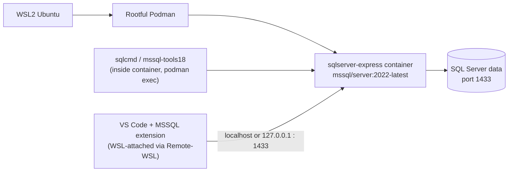

# MS SQL Server PoC on WSL2 / Podman
### Building basic MS-SQL familiarity as groundwork for SQL Server → PostgreSQL migration work

This is a hands-on, fully reproducible PoC: every command below is copy-paste runnable from a clean WSL2/Podman setup, using either the CLI (`sqlcmd`) or VS Code with the MSSQL extension. Follow it top to bottom to replicate the same environment for your own experimentation.

---

## 1. What This PoC Covers

- Pull and run **SQL Server 2022 Express** as a rootful Podman container on WSL2 Ubuntu
- Connect using **sqlcmd** (built into the image — no separate download) for a fully scripted, reproducible workflow
- Connect using **VS Code + the MSSQL extension** as a GUI option, including the WSL2 networking checks needed to make that connection succeed
- Run all the basic DB operations a DBA needs to know: DDL, DML, constraints, indexes, views, stored procedures, functions, triggers, transactions, backup/restore
- A **T-SQL ↔ PL/pgSQL ↔ PL/SQL cheat sheet**, since the end goal is SQL Server → PostgreSQL migration
- Single-command cleanup

### Architecture



**Predicted vs confirmed:** everything below is confirmed-working as of SQL Server 2022 CU-latest image; version-specific behavior (e.g. CU numbers, tool paths) can shift with image updates — always check `podman logs` on first boot.

---

## 2. Prerequisites

- WSL2 Ubuntu with **rootful Podman** already set up (per your existing convention)
- ~4 GB free RAM for the container (SQL Server Express is lighter than Standard/Enterprise but still needs headroom)
- Port `1433` free on the WSL2 instance

```bash
# Confirm podman is rootful and working
podman info --format '{{.Host.Security.Rootless}}'   # should print false
podman --version
```

---

## 3. Step 1 — Pull & Run SQL Server Container

### Why Express edition for this PoC

Express is free and needs no license key (`MSSQL_PID=Express` with `ACCEPT_EULA=Y` is all it takes) — that's the whole reason it's used here over Standard or Enterprise, since this is a learning/exploration PoC, not a production deployment. It's still a real, fully production-capable edition of the engine, just capped:

| Edition | Production-ready? | Target workload / limits |
|---|---|---|
| Enterprise | ✅ Yes | Large-scale production — Always On HA, full memory/CPU scaling, advanced security features |
| Standard | ✅ Yes | Mid-sized production — core database features, capped at 4 sockets / 32 cores and 256 GB RAM |
| **Express** ⭐ *(used in this PoC)* | ✅ Yes (Limited) | Free, entry-level production edition — small desktop/web workloads, capped at 10 GB per database and minimal RAM/CPU use |

Every T-SQL construct in Steps 4–6 (DDL, DML, indexes, views, procs, functions, triggers, transactions, backup/restore) behaves identically on Express as it would on Standard or Enterprise — the cap only affects database size and resource ceilings, not language or feature availability at the level this PoC exercises. If you later need to test Always On, larger datasets, or enterprise-only features, swap the image tag/PID; the container commands and T-SQL below don't change.

```bash
mkdir -p ~/mssql-poc && cd ~/mssql-poc

podman run -d \
  --name sqlserver-express \
  -e ACCEPT_EULA=Y \
  -e MSSQL_SA_PASSWORD=Passw0rd@123 \
  -e MSSQL_PID=Express \
  -p 1433:1433 \
  mcr.microsoft.com/mssql/server:2022-latest
```

```bash
# Confirm it's up (first boot takes 15-30s to initialize)
podman ps --filter name=sqlserver-express

# Watch startup logs until you see "SQL Server is now ready for client connections"
podman logs -f sqlserver-express
```

> Ctrl+C to stop following logs once you see the ready message — the container keeps running.

---

## 4. Step 2 — Connect via sqlcmd (built into the image)

The 2022 image ships `mssql-tools18` at `/opt/mssql-tools18/bin/sqlcmd`. No separate install needed — this is the fastest, most scriptable path and fits a heredoc-driven workflow.

```bash
# Quick connectivity test
podman exec -it sqlserver-express /opt/mssql-tools18/bin/sqlcmd \
  -S localhost -U sa -P 'Passw0rd@123' -C -Q "SELECT @@VERSION;"
```

`-C` trusts the self-signed TLS cert (required on 2022 images since encryption is on by default).

To make this less painful for repeated use, drop a wrapper script:

```bash
cat > ~/mssql-poc/sqlcmd.sh << 'EOF'
#!/bin/bash
podman exec -it sqlserver-express /opt/mssql-tools18/bin/sqlcmd \
  -S localhost -U sa -P 'Passw0rd@123' -C "$@"
EOF
chmod +x ~/mssql-poc/sqlcmd.sh
```

Now you can just run `~/mssql-poc/sqlcmd.sh -Q "SELECT 1"` or drop into interactive mode with `~/mssql-poc/sqlcmd.sh`.

---

## 5. Step 3 — Connect via VS Code + MSSQL Extension (GUI option)

Azure Data Studio was [retired by Microsoft on February 28, 2026](https://learn.microsoft.com/en-us/sql/tools/whats-happening-azure-data-studio?view=sql-server-ver17) — no more updates or security patches. Microsoft's official successor is **VS Code with the MSSQL extension**, so that's the GUI path here. Also worth noting for the record: same as ADS, there's no official *container* image for VS Code either — it's installed as a desktop app, with WSL support handled through the **Remote - WSL** extension rather than by containerizing the editor itself.

Since your whole stack already lives in WSL2, the cleanest setup is to run VS Code *attached to* WSL (via Remote - WSL) rather than purely on the Windows side — that way the MSSQL extension runs in the same network namespace as the Podman container and just talks to `localhost` directly.

### 5.1 Install VS Code + Remote-WSL (one-time)

```bash
# From Windows: install VS Code first (https://code.visualstudio.com), then from your WSL2 shell:
code --version   # confirms the 'code' CLI shim is available inside WSL
```

If `code` isn't found, open VS Code on Windows once and install the **WSL** extension (`ms-vscode-remote.remote-wsl`) from the Extensions view — this also registers the `code` CLI inside your WSL distro.

### 5.2 Open your PoC folder in a WSL-attached VS Code window

```bash
cd ~/mssql-poc
code .
```

This launches VS Code on Windows but *attached* to your WSL2 Ubuntu instance (you'll see "WSL: Ubuntu" in the bottom-left status bar). VS Code silently installs a small VS Code Server inside WSL the first time — no action needed.

### 5.3 Install the MSSQL extension inside the WSL context

In the WSL-attached window's Extensions view, search **"SQL Server (mssql)"** (publisher: Microsoft) and install it. Because the window is WSL-attached, VS Code installs the extension *inside WSL*, not just on Windows — confirm this from the WSL shell:

```bash
code --list-extensions --remote wsl+Ubuntu | grep mssql
# Optional: install unattended, one-liner
code --install-extension ms-mssql.mssql --remote wsl+Ubuntu
```

### 5.4 Check your WSL2 networking mode before connecting

WSL2 has two networking modes, and which one you're on changes how `localhost` behaves — this is the single most common reason the MSSQL extension fails to connect even when the container is perfectly healthy. Check yours from **Windows PowerShell**:

```powershell
cat $env:USERPROFILE\.wslconfig
```

Look for a `[wsl2]` section with `networkingMode=mirrored`. Then work out which case you're in:

- **No `.wslconfig`, or no `networkingMode` line (default / NAT mode):** `localhost` in a WSL-attached VS Code window resolves directly inside WSL2's own network namespace — this normally just works with `Server name: localhost`.
- **`networkingMode=mirrored`:** Windows and WSL2 share the loopback address space, but on some builds the IPv6 leg of `localhost` (`::1`) fails to connect even though the IPv4 leg (`127.0.0.1`) works fine — VS Code's connection dialog resolves `localhost` and can hit the broken IPv6 path first, surfacing as a generic "could not open a connection to SQL Server" error.

Either way, confirm the port is actually reachable before touching VS Code at all — this isolates "networking problem" from "container problem":

```bash
# From your WSL2 shell
nc -zv localhost 1433
# or, if nc isn't installed:
bash -c 'cat < /dev/null > /dev/tcp/localhost/1433' && echo "PORT OPEN" || echo "PORT CLOSED"
```

If that succeeds but VS Code still fails to connect, and you're on mirrored networking, also test from **Windows PowerShell** directly:

```powershell
Test-NetConnection -ComputerName localhost -Port 1433
```

A result showing the IPv6 leg (`::1`) failing while the IPv4 leg (`127.0.0.1`) succeeds confirms the mirrored-mode IPv6 loopback issue.

### 5.5 Connect to the container

Open the MSSQL extension's connection panel (database icon in the sidebar → "Add Connection") and fill in:

```text
Server name:      localhost    (use 127.0.0.1 instead if you're on mirrored networking — see 5.4)
Authentication:   SQL Login
User name:        sa
Password:         Passw0rd@123
Trust server certificate: Yes   (self-signed cert, dev use only)
Database:         <leave default, or PocDB once created in Step 4>
```

On default/NAT networking, `localhost` resolves directly to the Podman container's exposed port with no cross-boundary forwarding to reason about. On mirrored networking, use `127.0.0.1` explicitly rather than `localhost` — it sidesteps the IPv6 loopback issue from 5.4 entirely and is the fastest fix if you hit a connection error here.

### 5.6 Run a test query

Create `~/mssql-poc/test.sql`, open it in the connected editor, and run:

```sql
SELECT @@VERSION;
SELECT name, state_desc FROM sys.databases;
```

Use **Ctrl+Shift+E** (or the "Execute Query" command) to run — results render in a grid panel, same as ADS used to.

If you'd rather stay fully in-terminal instead, skip this whole section and use `sqlcmd.sh` from Step 4 — your call.

---

## 6. Step 4 — Basic T-SQL Operations

All commands below use the `sqlcmd.sh` wrapper. Each block is copy-paste reproducible and builds on the last.

### 6.1 Database creation

```bash
~/mssql-poc/sqlcmd.sh -Q "
CREATE DATABASE PocDB;
"
~/mssql-poc/sqlcmd.sh -Q "SELECT name, state_desc FROM sys.databases;"
```

### 6.2 Tables, constraints, DML

```bash
~/mssql-poc/sqlcmd.sh -d PocDB -Q "
CREATE TABLE dbo.Employees (
    EmpId       INT IDENTITY(1,1) PRIMARY KEY,
    EmpName     VARCHAR(100) NOT NULL,
    Dept        VARCHAR(50),
    Salary      DECIMAL(10,2) CHECK (Salary >= 0),
    HireDate    DATE DEFAULT GETDATE(),
    Email       VARCHAR(150) UNIQUE
);
"

~/mssql-poc/sqlcmd.sh -d PocDB -Q "
INSERT INTO dbo.Employees (EmpName, Dept, Salary, Email) VALUES
('Alice',   'Engineering', 95000, 'alice@example.com'),
('Bob',     'Engineering', 87000, 'bob@example.com'),
('Charlie', 'Sales',       72000, 'charlie@example.com');
"

~/mssql-poc/sqlcmd.sh -d PocDB -Q "SELECT * FROM dbo.Employees;"
```

### 6.3 UPDATE / DELETE

```bash
~/mssql-poc/sqlcmd.sh -d PocDB -Q "
UPDATE dbo.Employees SET Salary = Salary * 1.05 WHERE Dept = 'Engineering';
"
~/mssql-poc/sqlcmd.sh -d PocDB -Q "
DELETE FROM dbo.Employees WHERE EmpName = 'Charlie';
"
```

### 6.4 Indexes

```bash
~/mssql-poc/sqlcmd.sh -d PocDB -Q "
CREATE NONCLUSTERED INDEX IX_Employees_Dept ON dbo.Employees(Dept);
"
~/mssql-poc/sqlcmd.sh -d PocDB -Q "
SELECT i.name, i.type_desc FROM sys.indexes i
WHERE i.object_id = OBJECT_ID('dbo.Employees');
"
```

### 6.5 Views

```bash
~/mssql-poc/sqlcmd.sh -d PocDB -Q "
CREATE VIEW dbo.vw_EngineeringStaff AS
SELECT EmpName, Salary FROM dbo.Employees WHERE Dept = 'Engineering';
"
~/mssql-poc/sqlcmd.sh -d PocDB -Q "SELECT * FROM dbo.vw_EngineeringStaff;"
```

### 6.6 Stored procedures

```bash
~/mssql-poc/sqlcmd.sh -d PocDB -Q "
CREATE PROCEDURE dbo.usp_GetByDept
    @DeptName VARCHAR(50)
AS
BEGIN
    SELECT EmpName, Salary FROM dbo.Employees WHERE Dept = @DeptName;
END;
"
~/mssql-poc/sqlcmd.sh -d PocDB -Q "EXEC dbo.usp_GetByDept @DeptName = 'Engineering';"
```

### 6.7 Scalar functions

```bash
~/mssql-poc/sqlcmd.sh -d PocDB -Q "
CREATE FUNCTION dbo.fn_AnnualBonus (@Salary DECIMAL(10,2))
RETURNS DECIMAL(10,2)
AS
BEGIN
    RETURN @Salary * 0.10;
END;
"
~/mssql-poc/sqlcmd.sh -d PocDB -Q "
SELECT EmpName, Salary, dbo.fn_AnnualBonus(Salary) AS Bonus FROM dbo.Employees;
"
```

### 6.8 Triggers

```bash
~/mssql-poc/sqlcmd.sh -d PocDB -Q "
CREATE TABLE dbo.EmployeeAudit (
    AuditId INT IDENTITY(1,1) PRIMARY KEY,
    EmpId INT, ChangeType VARCHAR(10), ChangedAt DATETIME DEFAULT GETDATE()
);
"
~/mssql-poc/sqlcmd.sh -d PocDB -Q "
CREATE TRIGGER trg_Employees_Update ON dbo.Employees
AFTER UPDATE
AS
BEGIN
    INSERT INTO dbo.EmployeeAudit (EmpId, ChangeType)
    SELECT EmpId, 'UPDATE' FROM inserted;
END;
"
~/mssql-poc/sqlcmd.sh -d PocDB -Q "UPDATE dbo.Employees SET Salary = Salary + 1000 WHERE EmpId = 1;"
~/mssql-poc/sqlcmd.sh -d PocDB -Q "SELECT * FROM dbo.EmployeeAudit;"
```

### 6.9 Transactions

```bash
~/mssql-poc/sqlcmd.sh -d PocDB -Q "
BEGIN TRANSACTION;
UPDATE dbo.Employees SET Salary = Salary - 5000 WHERE EmpId = 1;
UPDATE dbo.Employees SET Salary = Salary + 5000 WHERE EmpId = 2;
COMMIT TRANSACTION;
SELECT EmpId, EmpName, Salary FROM dbo.Employees;
"
```

---

## 7. Step 5 — Backup & Restore

```bash
# Backup to a path inside the container's writable layer
~/mssql-poc/sqlcmd.sh -Q "
BACKUP DATABASE PocDB TO DISK = '/var/opt/mssql/data/PocDB.bak';
"

# Copy the .bak file out to the WSL2 host for safekeeping
podman cp sqlserver-express:/var/opt/mssql/data/PocDB.bak ~/mssql-poc/PocDB.bak

# Restore drill: drop and restore from the same file
~/mssql-poc/sqlcmd.sh -Q "
ALTER DATABASE PocDB SET SINGLE_USER WITH ROLLBACK IMMEDIATE;
DROP DATABASE PocDB;
RESTORE DATABASE PocDB FROM DISK = '/var/opt/mssql/data/PocDB.bak';
ALTER DATABASE PocDB SET MULTI_USER;
"
~/mssql-poc/sqlcmd.sh -d PocDB -Q "SELECT COUNT(*) FROM dbo.Employees;"
```

---

## 8. Step 6 — Useful System Catalog / DMV Queries

```bash
# List all databases
~/mssql-poc/sqlcmd.sh -Q "SELECT name, database_id, create_date FROM sys.databases;"

# List tables in current DB
~/mssql-poc/sqlcmd.sh -d PocDB -Q "SELECT name FROM sys.tables;"

# Column metadata
~/mssql-poc/sqlcmd.sh -d PocDB -Q "
SELECT c.name, t.name AS data_type, c.max_length
FROM sys.columns c
JOIN sys.types t ON c.user_type_id = t.user_type_id
WHERE c.object_id = OBJECT_ID('dbo.Employees');
"

# Active sessions / connections (DBA habit, carries over from Oracle v\$session)
~/mssql-poc/sqlcmd.sh -Q "SELECT session_id, login_name, status FROM sys.dm_exec_sessions WHERE is_user_process = 1;"

# Version + edition
~/mssql-poc/sqlcmd.sh -Q "SELECT SERVERPROPERTY('ProductVersion'), SERVERPROPERTY('Edition');"
```

---

## 9. T-SQL ↔ PostgreSQL (PL/pgSQL) ↔ Oracle (PL/SQL) Cheat Sheet

| Concept | T-SQL (SQL Server) | PL/pgSQL (PostgreSQL) | PL/SQL (Oracle) |
|---|---|---|---|
| Auto-increment PK | `IDENTITY(1,1)` | `GENERATED ALWAYS AS IDENTITY` / `SERIAL` | `GENERATED ALWAYS AS IDENTITY` / sequence + trigger |
| Current date/time | `GETDATE()` | `now()` / `CURRENT_TIMESTAMP` | `SYSDATE` |
| String concat | `+` | `\|\|` | `\|\|` |
| Top N rows | `SELECT TOP 10 ...` | `SELECT ... LIMIT 10` | `SELECT ... FETCH FIRST 10 ROWS ONLY` / `ROWNUM` |
| Variable declare | `DECLARE @x INT` | `x INT;` (inside `DO $$ ... $$` or function) | `x NUMBER;` (inside `DECLARE` block) |
| Stored proc | `CREATE PROCEDURE ... AS BEGIN ... END` | `CREATE PROCEDURE ... LANGUAGE plpgsql AS $$ ... $$` | `CREATE OR REPLACE PROCEDURE ... IS BEGIN ... END;` |
| Function return | `RETURNS <type> ... RETURN` | `RETURNS <type> ... LANGUAGE plpgsql AS $$ ... RETURN ...; $$` | `RETURN <type> IS BEGIN RETURN ...; END;` |
| Error handling | `TRY ... CATCH` | `BEGIN ... EXCEPTION WHEN ... THEN` | `BEGIN ... EXCEPTION WHEN ... THEN` |
| Sequences | `IDENTITY` (no standalone `CREATE SEQUENCE` needed, but supported) | `CREATE SEQUENCE` | `CREATE SEQUENCE` |
| Pagination | `OFFSET x ROWS FETCH NEXT y ROWS ONLY` | `LIMIT y OFFSET x` | `OFFSET x ROWS FETCH NEXT y ROWS ONLY` |
| Data type: text | `VARCHAR(MAX)`, `NVARCHAR(MAX)` | `TEXT`, `VARCHAR` | `CLOB`, `VARCHAR2` |
| Data type: boolean | `BIT` | `BOOLEAN` | `NUMBER(1)` (no native boolean pre-23c) |
| Upsert | `MERGE` | `INSERT ... ON CONFLICT DO UPDATE` | `MERGE` |
| List objects | `sys.tables`, `sys.databases` | `information_schema.tables`, `pg_catalog` | `USER_TABLES`, `ALL_TABLES` |
| Migration-relevant gotcha | `IDENTITY` columns need `SET IDENTITY_INSERT` to override | Sequences can be manually reset with `setval()` | Sequences are fully decoupled from columns |

**Key migration-planning takeaway:** T-SQL's biggest structural divergence from PostgreSQL is in procedural syntax (`BEGIN...END` blocks without a `DECLARE` wrapper, `TRY/CATCH` vs exception blocks) and in pagination/identity handling — these are usually the bulk of the rewrite effort in an SQL Server → PostgreSQL migration, not the base DDL.

---

## 10. Troubleshooting

| Symptom | Likely Cause | Fix |
|---|---|---|
| Container exits immediately after `podman run` | Password doesn't meet complexity policy (needs upper+lower+digit+symbol, 8+ chars) | Use a stronger `MSSQL_SA_PASSWORD` and re-run |
| `sqlcmd: command not found` | Wrong path or older image without `mssql-tools18` | Check `/opt/mssql-tools18/bin/` vs `/opt/mssql-tools/bin/` depending on image tag |
| `Login failed for user 'sa'` | Container still initializing | Wait for "SQL Server is now ready for client connections" in `podman logs` |
| TLS/cert errors from sqlcmd | 2022 image encrypts by default | Add `-C` to trust the self-signed cert (dev only) |
| VS Code MSSQL extension: "A network-related or instance-specific error... (Named Pipes Provider, error: 40)" | Usually WSL2 mirrored networking's `localhost` resolving to a broken IPv6 (`::1`) loopback leg, even though IPv4 works | Use `127.0.0.1` instead of `localhost` as the Server name in the connection dialog (see Step 3, section 5.4) |
| VS Code MSSQL extension can't reach the container at all | Port forwarding not active, or container not actually listening | Confirm `podman ps` shows `0.0.0.0:1433->1433`; check `podman logs` for the ready message; restart WSL (`wsl --shutdown`) if forwarding is stale |
| `BACKUP DATABASE` fails with permission error | Writing outside `/var/opt/mssql/data/` (the only writable path by default) | Always back up inside that directory, then `podman cp` out |
| Out-of-memory container restarts | Express edition still needs real RAM headroom | Ensure WSL2 `.wslconfig` allocates at least 4 GB to the VM |

---

## 11. Cleanup

```bash
# Stop and remove the container
podman stop sqlserver-express
podman rm sqlserver-express

# Remove the image (optional — skip if you'll rerun this PoC soon)
podman rmi mcr.microsoft.com/mssql/server:2022-latest

# Remove local artifacts (backup file, wrapper script, working dir)
rm -rf ~/mssql-poc
```

Single-command version for a full teardown:

```bash
podman stop sqlserver-express && podman rm sqlserver-express && podman rmi mcr.microsoft.com/mssql/server:2022-latest && rm -rf ~/mssql-poc
```

**Author:** Mariyan Clement  ([@softclement](https://github.com/softclement)) 
